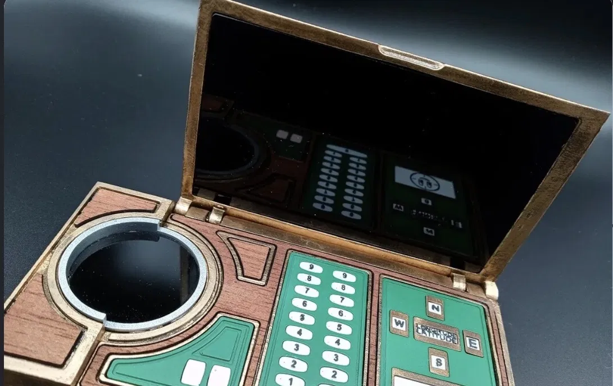
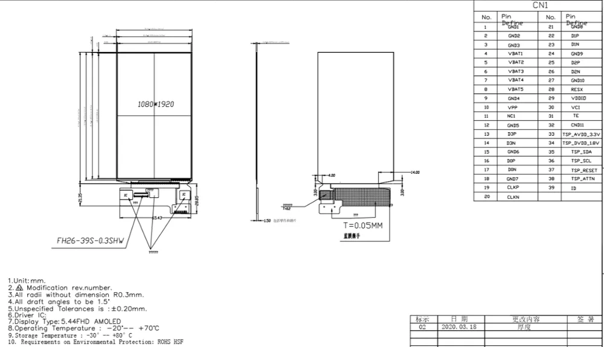
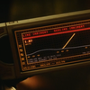
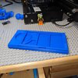

# TemPad — Hack Club Half Life

A DIY **TemPad** inspired by the *Doctor Who* prop, built as a Hack Club **Half Life** hardware project.

This project combines **CAD** for the enclosure with a real electronics prototype built on a **breadboard and jumper wires**. There is **no custom PCB** in this project.

## Half Life project

TemPad is a good fit for Half Life because it combines multiple hardware skills:

- **CAD:** the enclosure is designed as a 3D-printable model.
- **Breadboard electronics:** the electronics are assembled on a breadboard.
- **Wiring:** components are connected with jumper wires rather than a custom PCB.
- **Display/UI:** the project includes the TemPad interface and display hardware.
- **3D printing:** `tempad.stl` is the enclosure/model file to print.

## Hardware

The physical prototype uses:

- Breadboard
- Jumper wires
- Display
- Buttons / input controls
- Supporting electronics
- 3D-printed TemPad enclosure

**Important:** this build uses a breadboard and wires. **No PCB is used.**

## 3D model

The printable model is:

`tempad.stl`

The STL has been renamed to `tempad.stl` for the project.

## Reference images

### TemPad reference



### Display / dimensions reference



### Additional reference



### Additional reference



## Project structure

Everything is intentionally kept in **one folder**. There are **zero subfolders** in this project.

```text
tempad/
├── README.md
├── tempad.stl
├── main.py
├── main.cpp
├── main.qml
├── Base.qml
├── Frame.qml
├── PadText.qml
├── Constants.qml
├── app_constants.qml
├── Icons.qml
├── qmldir
├── qml.qrc
├── CMakeLists.txt
├── INSTALL.md
├── perlin.js
├── MorePerfectDOSVGA.ttf
├── icon_crosshair.png
├── icon_diag.png
├── icon_offset.png
├── icon_arrow.png
├── icon_rss.png
├── TimeVarianceAuthorityLogo.png
├── cogwheel-outline-svgrepo-com.svg
├── reference-1.png
├── reference-2.png
├── reference-3.png
└── reference-4.png
```

## Goal

Build a recognizable, functional TemPad while learning the hardware skills covered by Hack Club Half Life: CAD, physical electronics, wiring, displays, and hands-on prototyping.

---

Made for **Hack Club Half Life**.
